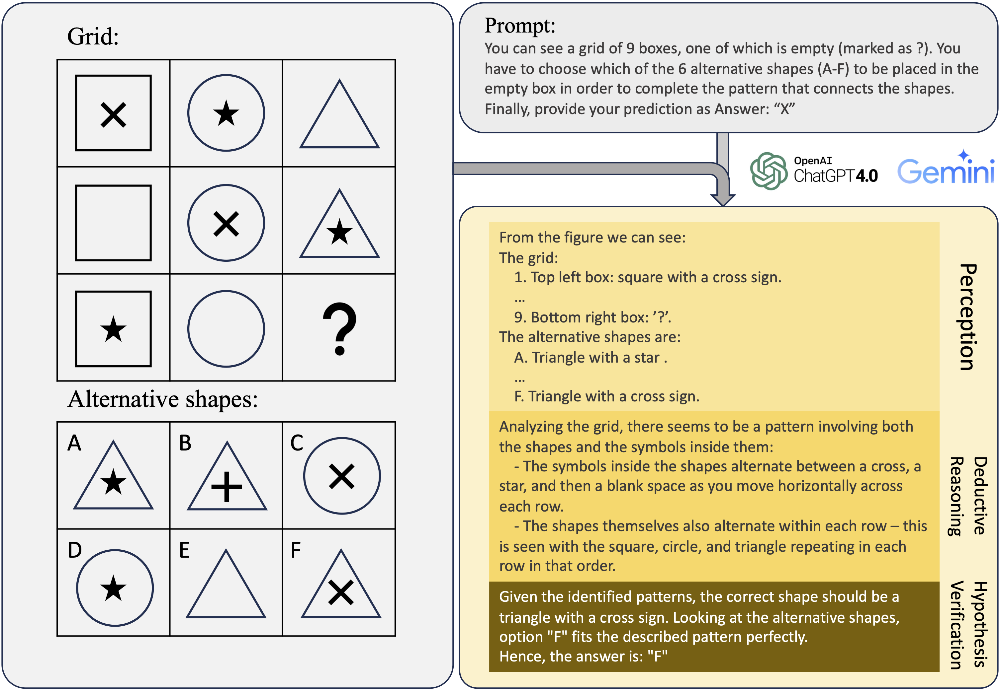

# Visual Reasoning Benchmark

This repo accompanies the research paper, [How Far Are We from Intelligent Visual Deductive Reasoning](https://arxiv.org/abs/2403.04732), CoLM 2024 main conference and ICLR 2024 AGI Workshop.


## Highlights


<p align = "center">

</p>

Vision-Language Models (VLMs), like GPT-4V, have made significant progress in various tasks but face challenges in visual deductive reasoning. Using Raven’s Progressive Matrices (RPMs), we find **blindspots** in VLMs' abilities for multi-hop relational reasoning. Specifically, we provide the following contributions:

- **Evaluation Framework:**
  - Systematically assessed various SOTA VLMs on three datasets: Mensa IQ test, IntelligenceTest, and RAVEN.
  - Comprehensive performance evaluation reveals a gap between text-based and pure image-based reasoning capabilities in large foundation models.

- **Performance Bottleneck Analysis:**
  - Breakdown of VLM capability into *perception*, *deductive reasoning*, and *hypothesis verification*.
  - Case study of GPT-4V highlights specific issues.

- **Issues/Findings in Current VLMs:**
  - Perception emerges as the primary limiting factor in current VLMs' performance.
  - Complementary text description is needed for optimal deductive reasoning.
  - Some effective LLM strategies (e.g., in-context learning) do not seamlessly transfer to VLMs.
  - Overconfidence, sensitivity to prompt design, and ineffective utilization of in-context examples.


## Motivation

- Evaluate your VLMs against popular VLMs across hundreds of RPM tasks in three datasets.
- Determine whether your VLMs can significantly mitigate the compounding errors or confounding errors outlined in the paper.


<div align="center">
	
|                  | **Mensa**              |                           | **IntelligenceTest**     |                           | **RAVEN**                |                           |
|------------------|:----------------------:|---------------------------|:------------------------:|---------------------------|:------------------------:|---------------------------|
|                  | **Entropy**            | **Accuracy**$\uparrow$    | **Entropy**              | **Accuracy**$\uparrow$    | **Entropy**              | **Accuracy**$\uparrow$    |
| GPT-4V           | $1.49$                 | $0.24 \pm 0.05$           | $1.40$                   | $0.16\pm 0.04$            | $2.07$                   | $0.12 \pm 0.04$           |
| Gemini Pro       | $1.24$                 | $0.15 \pm 0.04$           | $1.18$                   | $0.18 \pm 0.03$           | $1.37$                   | $0.11 \pm 0.04$           |
| QWen-VL-Max      | $1.13$                 | $0.17 \pm 0.01$           | $0.97$                   | $0.13 \pm 0.02$           | $0.48$                   | $0.10 \pm 0.03$           |
| LLaVA-1.5-13B    | $0.72$                 | $0.23 \pm 0.01$           | $0.64$                   | $0.09 \pm 0.01$           | $0.25$                   | $0.10 \pm 0.03$           |
||||||||
| GPT-4V (0-shot)  | $1.49$                 | $0.24 \pm 0.05$           | $1.40$                   | $0.16\pm 0.04$            | $2.07$                   | $0.12 \pm 0.04$           |
| GPT-4V (1-shot)  | $1.41$                 | $0.22 \pm 0.06$           | $1.31$                   | $0.17 \pm 0.04$           | $2.03$                   | $0.12 \pm 0.04$           |
| GPT-4V (Self-consistency)      | $0.17$                 | $0.31 \pm 0.01$           | $0.15$                   | $0.19 \pm 0.02$           | $0.20$                   | $0.10 \pm 0.02$           |
||||||||
| Gemini Pro (0-shot)| $1.24$               | $0.15 \pm 0.04$           | $1.18$                   | $0.18 \pm 0.03$           | $1.37$                   | $0.11 \pm 0.04$           |
| Gemini Pro (1-shot)| $0.69$               | $0.17 \pm 0.03$           | $0.54$                   | $0.19 \pm 0.01$           | $1.35$                   | $0.10 \pm 0.03$           |
| Gemini Pro (Self-consistency)  | $0.03$                 | $0.18 \pm 0.01$           | $0.03$                   | $0.18 \pm 0.01$           | $0.08$                   | $0.10 \pm 0.01$           |


</div>


## Getting Started 

### 0. Install dependencies
```bash
pip install -r requirements.txt
```
#### Specify your OpenAI credential (API key)
```bash
export OPENAI_API_KEY="sk-XXXX"
```


### 1. Data
Data used in our paper:
```
#### Raven:
data/raven.tsv
#### Intelligence Test:
data/it-pattern.tsv
```
Note: 
For Raven dataset, there are images in this repo. 
For Intelligence Test data, our repo do not host any images, but the urls of the images are provided: `data/it-pattern/it-pattern.jsonl`.

Generate your own Raven data:
```
python data/raven/src/main.py --num-samples 20 --save-dir data/raven/images
```


### 2. Generation
Here we provide a simply script to eval GPT4V with mensa examples:
```
python src/main.py --data data/manually_created.tsv --model GPT4V --prompt mensa --output_folder output
```

#### Command-line Arguments:

*Required:*

- `--data`: Specifies the input data to the script.
- `--model`: Specifies the model name used for generation
- `--prompt`: Specifies the prompt name used for generation

*Optional:*

- `--output_folder`: Path to the output folder containing generation and prediction


## Citation
Please consider citing [our work](https://arxiv.org/abs/2403.04732) if it is helpful to your research.
```
@article{zhang2024far,
      title={How Far Are We from Intelligent Visual Deductive Reasoning?}, 
      author={Yizhe Zhang and He Bai and Ruixiang Zhang and Jiatao Gu and Shuangfei Zhai and Josh Susskind and Navdeep Jaitly},
      year={2024},
      eprint={2403.04732},
      archivePrefix={arXiv},
      primaryClass={cs.AI}
}
```


<!-- ## Poster
<p align = "center">

</p>
<p align = "center">
Poster for the entity-deduction arena
</p> -->
